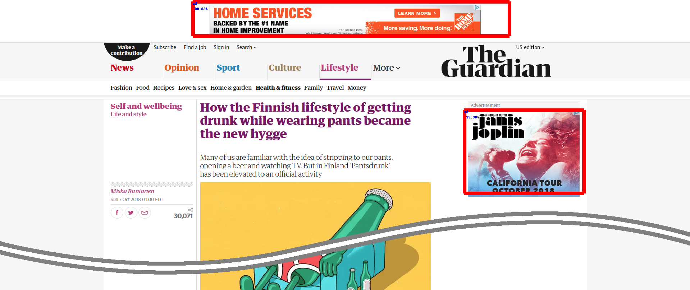

# Ad-versarial: Defeating Perceptual Ad-Blocking

This repository contains code to create, evaluate, and attack various types of 
*Perceptual Ad-Blockers*.

Our results are described in the following paper:

*Ad-versarial: Defeating Perceptual Ad-Blocking* </br>
**Florian Tramèr, Pascal Dupré, Gili Rusak, Giancarlo Pellegrino, and Dan Boneh** </br>
[arxiv:1811:03194](http://arxiv.org/abs/1811.03194)

## Background
Perceptual ad-blocking was recently proposed as a novel, more robust, way of automatically 
detecting online ads, by relying on *visual cues* to detect ads, in the same way as a 
human user would 
(see [The Future of Ad Blocking: An Analytical Framework and New Techniques](https://arxiv.org/abs/1705.08568)).

This idea has recently attracted the attention of [Adblock Plus](https://adblockplus.org/), 
who unveiled [Sentinel](https://adblock.ai/), a prototype neural network that detects ads 
in Facebook screenshots.
We trained a similar model on screenshots from hundreds of different news websites. 
As shown below, it does a pretty good job of locating ads (here on an article from 
[The Guardian](https://www.theguardian.com)):

<p align="center">

</p>

A video demonstrating our model in action while browsing real websites is [here](videos/yolov3_perceptual_adblocker_detection.mp4).

The goal of our work is to show that while sound in principle, perceptual ad-blocking can 
be easily defeated when instantiated with current computer vision techniques. 
Specifically, we create **adversarial examples** for ad-detection classifiers that allow 
web publishers or ad networks to evade and detect perceptual ad-blocking. 
We construct adversarial examples both for traditional computer vision algorithms 
(e.g., perceptual hashing, SIFT or OCR) aimed at detecting ad-disclosure cues such as the
[AdChoices logo](https://en.wikipedia.org/wiki/AdChoices), as well as for deep neural 
networks such as Sentinel that find ads in rendered web content.

As an example, the below two images are respectively a standard AdChoices logo (left), 
an adversarial example for SIFT (middle) which can be used to evade ad-blocking while still 
disclosing ads to users, and a mostly invisible false positive for SIFT (right) which could be 
used as a "honeypot" to detect ad-blocking.

AdChoices logo                      | Adversarial example for SIFT                    | False positive for SIFT                  |
:----------------------------------:|:-----------------------------------------------:|:----------------------------------------:|
  |  |  |

For perceptual ad-blockers like [Sentinel](https://adblock.ai/) that operate on full webpage 
screenshots, crazier attacks are possible. In the below mock Facebook screenshot, Jerry 
uploaded a perturbed image that causes the ad-blocker to block Tom's content instead:

<p align="center">
  
</p>

## Installation

Our attacks and evaluations use `python 3`.
The main requirements are `OpenCV` (version 3.4.1), `TensorFlow` and `Keras`.
All requirements can be installed by running
```bash
pip install -r requirements.txt
```

## Training, Evaluating and Attacking Perceptual Ad-Blockers

Pre-trained models as well as data used for training and evaluating attacks can be found 
here: https://github.com/ftramer/ad-versarial/releases
The data is expected to be placed under [data](data) and the pre-trained models under 
[models](models).

The subdirectory [element-frame-based](element-frame-based) contains implementations and 
attacks for what we call "element-based" and "frame-based" perceptual ad-blockers. These 
do not operate over full rendered web-pages (as [Sentinel](https://adblock.ai/) does), but 
first segment a webpage into smaller fragments to be classified. See the 
[README](element-frame-based/README.md) for detailed information.

The subdirectory [page-based](page-based) contains our implementation of a "page-based" 
perceptual ad-blocker similar to [Sentinel](https://adblock.ai/), which we trained to 
locate ads on arbitrary websites. A video demonstrating it in action can be found in our 
[release](https://github.com/ftramer/ad-versarial/releases).
See the [README](page-based/README.md) for detailed information on training, evaluating and 
attacking this model.

