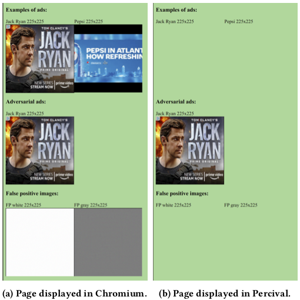

# Element-Based and Frame-Based Perceptual Ad-Blocking

We evaluate the following techniques. Element-based techniques are simple computer-vision 
algorithms that aim at detecting stand-alone images the AdChoices logo.
Frame-based techniques operate on rendered portions of web content (iframes in this case).

**Element-based algorithms**:
- [OCR](#OCR)
- [Average Hashing](#Average-Hashing)
- [SIFT](#SIFT)

**Frame-based algorithms**:
- [YOLO-v3 model that detects the AdChoices logo](#YOLO-v3)
- [ResNet model that recognizes images of ads](#Resnet)
- [MobileNet model used in Percival](#Percival)

## Data

Data used to train models or evaluate attacks can be found here: 
https://github.com/ftramer/ad-versarial/releases.
The contents of the `data` folder are expected to be in [../data](../data).

Specifically:
- [../data/ad_logos](../data/ad_logos) contains AdChoices logos collected in [Ad Highlighter](`https://github.com/citp/ad-blocking/tree/master/perceptual-adblocker/actual_icons`)
- [../data/web](../data/web) contains images and rendered iframes collected from 10 news websites


## Evaluation and Attacks
Under `scripts` are bash scripts that generate adversarial examples for all 
AdChoices logos in [../data/web/ad_logos](../data/web/ad_logos) for all element-based classifiers.

Each subdirectory also contains specific information on how to run or attack specific classifiers.


### Element-Based Techniques

We evaluate and attack various element-based techniques to detect the AdChoices logo.

#### Exact Matching
To test exact matching of AdChoices logos, run

```bash
python exact_match.py ../data/ad_logos/ "../data/web/*/adchoice" temp
```

#### Average Hashing
Average hashing is a simple template matching technique, that computes binary image hashes 
by comparing each input pixel to the mean pixel value.

To evaluate the model on AdChoices logos found on CNN.com:
```bash
python -m phash.model ../data/ad_logos/ "../data/web/www.cnn.com/adchoice/"
```

To create an adversarial example that evades detection 
(i.e., it isn't matched by any of the templates in [../data/ad_logos/](../data/ad_logos/)):
```bash
python -m phash.attack ../data/ad_logos/aol.png temp ../data/ad_logos/
```

To create a false positive that macthes with `../data/ad_logos/aol.png`:
```bash
python -m phash.attack_false_positive ../data/ad_logos/aol.png temp
```

#### SIFT
SIFT is a powerful template-matching algorithm that compares images based on certain 
keypoints extracted by the algorithm.

SIFT is no longer included in the latest versions of OpenCV. 
We tested our code with OpenCV 3.4.1

We use SIFT to detect the full AdChoices logo (i.e., with text).

To evaluate the model on AdChoices logos found on CNN.com:
```bash
python -m sift.model ../data/ad_logos/ "../data/web/www.cnn.com/adchoice/"
```

To create an adversarial example that evades detection 
(i.e., it matches less than 5% of the keypoints for all the templates 
in [../data/ad_logos/](../data/ad_logos/)):
```bash
python -m sift.black_box_attack ../data/web/ad_logos/text/9.png temp ../data/ad_logos/
```

To create a false positive that macthes 50% of keypoints 
with [../data/ad_logos/aol.png](../data/ad_logos/aol.png):
```bash
python -m sift.black_box_false_positive ../data/ad_logos/aol.png temp
```

#### OCR
We use [Tesseract](`https://github.com/tesseract-ocr/tesseract`)'s OCR model to 
transcribe textual AdChoices logos.

The model was ported to TensorFlow by Song and Shmatikov, who previously 
created adversarial examples for it: https://arxiv.org/abs/1802.05385.

Most of the code in this directory has been written by Congzheng Song. 
We modified `l2_attack.py` to simplify the attack somewhat, and also added the boilerplate 
in `eval.py`, `model.py` and `evade_or_fp_attack.py` to evaluate the model and attack.

To use the model, you first need to build a custom RNN operator for TensorFlow 
(https://www.tensorflow.org/guide/extend/op#build_the_op_library).

```bash
cd cc/
TF_CFLAGS=( $(python -c 'import tensorflow as tf; print(" ".join(tf.sysconfig.get_compile_flags()))') )
TF_LFLAGS=( $(python -c 'import tensorflow as tf; print(" ".join(tf.sysconfig.get_link_flags()))') )
g++ -std=c++11 -shared rnn_ops.cc -o rnn_ops.so -fPIC ${TF_CFLAGS[@]} ${TF_LFLAGS[@]} -O2
```

To run the model on a single image:
```bash
python -m OCR.eval --image=../data/ad_logos/aol.png --target_height=30
```

To evaluate the model on all AdChoices logos found on CNN.com:
```bash
python -m OCR.model --glob_path="../data/web/www.cnn.com/adchoice/" --target_height=30
```

To create an adversarial example that evades detection:
```bash
python -m OCR.evade_or_fp_attack --image=../data/ad_logos/aol.png \
    --target_height=30 --const=0.1 --iter=200 --lr=1.0 output_dir=temp
```

To create a false positive:
```bash
python -m OCR.evade_or_fp_attack --image=../data/ad_logos/aol.png \
    --target_height=30 --fp=True --start_blank=True --const=100.0 \
    --iter=1000 --lr=1.0 --output_dir=temp --threshold=1 \
    --chars_target_file=OCR/targets/fp_30.txt
```

### Frame-Based Techniques

#### YOLO-v3

The code in [logo_detection](logo_detection) trains a YOLO-v3 model 
to locate the AdChoices logo in rendered iframes.

Some code was adapted from [yolov3-tensorflow](https://github.com/yuto3o/yolov3-tensorflow).
We used [DarkNet](https://github.com/AlexeyAB/darknet) for training.

##### Training

Training data is generated with:
```bash
python3 -m logo_detection.data_gen
```
This uses an ad dataset collected by [Hussein et al.](http://people.cs.pitt.edu/~kovashka/ads/#image)

You can visualize boxes with [Yolo_mark](https://github.com/AlexeyAB/Yolo_mark):
```bash
./PATH_TO_YOLO_MARK/yolo_mark \
    logo_detection/data/adchoices \
    logo_detection/data/train.txt \
    logo_detection/data/adchoices.names
```

To get a better model, re-compute YOLO's anchors with:
```bash
./PATH_TO_DARKNET/darknet detector calc_anchors \
    logo_detection/data/adchoices.data \
    -num_of_clusters 9 \
    -width 416 -height 416
```
And set the new anchors in [logo_detection/yolo_v3.py](logo_detection/yolo_v3.py).

We make the following changes to the default YOLO3 configuration in 
[logo_detection/cfg/yolo-adchoices.cfg](logo_detection/cfg/yolo-adchoices.cfg):

- `classes=1` in lines 610, 696 and 783
- `filters=18` in lines 603, 689 and 776
- re-computed `anchors` (lines 609, 695, 782)
- changes for small classes (`layers = -1, 11`, `stride = 4` in lines 717, 720)
- add `flip=0` (line 17)

We train the model with:
```bash
./PATH_TO_DARKNET/darknet detector train \
    logo_detection/data/adchoices.data \
    logo_detection/cfg/yolo-adchoices.cfg \
    ../models/darknet53.conv.74
```

Finally, we run [logo_detection/convert_tf.py](logo_detection/convert_tf.py) to convert 
the darknet weights to Keras.

##### Evaluation and Attacks

A pre-trained model is available here: https://github.com/ftramer/ad-versarial/releases.
The below code assumes the model checkpoint is stored under 
[../models/frame_based_yolov3/](../models/frame_based_yolov3/).

We run [logo_detection/eval_accuracy.py](logo_detection/eval_accuracy.py) to evaluate 
accuracy and generate adversarial examples.

#### Resnet

We evaluate a ResNet model trained by Hussein et al. to recognize images of ads in
[Automatic Understanding of Image and Video Advertisements](`http://openaccess.thecvf.com/content_cvpr_2017/papers/Hussain_Automatic_Understanding_of_CVPR_2017_paper.pdf`).

The model should be obtained from the authors and stored 
under [../external/keras_resnet.h5](../external/keras_resnet.h5).

We evaluate the model and create adversarial examples with:
```bash
python -m resnet.test
```

#### Percival

[Percival](`https://arxiv.org/abs/1905.07444`) is a recently proposed patch for the Chromium and Brave browsers that adds an ad-detection neural network directly into the browser's rendering pipeline.
We evaluate the neural network used by Percival in a [Jupyter notebook](percival/attack.ipynb). To build Percival, follow the [official instructions](https://github.com/dxaen/percival).

We built a [proof-of-concept web page](percival/attack.html) to demonstrate that this attack works when deployed in Percival's instrumented Chromium browser:

<p align="center">
  
</p>
